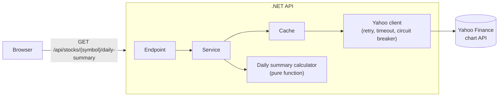

# Daily Stock Summary

A small full-stack app built for a take-home assessment. It reads the last month of 15-minute market data from Yahoo Finance's public chart API, groups it by trading day, and shows the result as a table and a chart for as many symbols as you like, on a dashboard whose panels you can drag, resize and reorder.

- **Backend:** .NET 10 minimal API. One endpoint returns, per trading day, the average of the 15-minute lows, the average of the highs, and the total volume.
- **Frontend:** React 19 + TypeScript. Add symbols, switch each panel between chart and table, rearrange panels by dragging their title bar. With no symbols the page is a simple welcome screen; once you add one, the header collapses into a slim top bar and the dashboard fills the window (two panels per row on laptops, three on wide screens, one on a phone). Light, dark and match-system themes. Errors appear as corner toasts.
- **No API key needed.** Yahoo's public chart endpoint is used as is.



## Contents

- [Quick start](#quick-start) · [Run the tests](#run-the-tests) · [Docker](#docker) · [Configuration](#configuration)
- [API reference](#api-reference) · [How the numbers are computed](#how-the-numbers-are-computed)
- [Design decisions](#design-decisions) · [Known limitations and future work](#known-limitations-and-future-work)
- [How this was built](#how-this-was-built)

## Quick start

Prerequisites: [.NET SDK 10](https://dotnet.microsoft.com/download) (the repo pins `10.0.401` in `backend/global.json` and allows newer feature bands) and Node.js 24.

**1. Start the API** (http://localhost:5241):

```bash
cd backend
dotnet run --project src/DailyStockSummary.Api --launch-profile http
```

Try it: `curl http://localhost:5241/api/stocks/TSLA/daily-summary`

**2. Start the frontend** (http://localhost:5173), in a second terminal:

```bash
cd frontend
npm ci
cp .env.example .env.local   # points the app at http://localhost:5241
npm run dev
```

Open http://localhost:5173, type a symbol such as `TSLA`, `AAPL`, `^GSPC` or `BTC-USD`, and press Enter. Add a few more, then drag a panel by its title bar to rearrange the dashboard. Your symbols, views, positions, sizes and theme are remembered in the browser.

## Run the tests

```bash
cd backend  && dotnet test                  # xUnit: unit, parser against real captured Yahoo data, full-stack API tests
cd frontend && npm test                     # Vitest + React Testing Library
cd frontend && npm run lint && npm run build && npm run format:check
```

The backend tests never touch the network. They replace only Yahoo's HTTP handler, so every API test still goes through routing, validation, rate limiting, CORS, caching, resilience, the Yahoo client, the parser and the calculator. Two real one-month responses (`TSLA`, `BTC-USD`) are stored as fixtures, and their expected daily values were computed independently of the code under test.

## Docker

```bash
docker compose up --build
```

Then open http://localhost:8080. Two containers run: the API (not published) and nginx, which serves the built frontend and proxies `/api/` to the API. The browser therefore sees one origin and no CORS is involved. Both images run as non-root users.

GitHub Actions (`.github/workflows/ci.yml`) runs the backend build and tests, the frontend format/lint/build/tests, dependency audits, and builds both images and smoke-tests them through nginx.

## Configuration

The API reads standard ASP.NET configuration, so any setting can be overridden with an environment variable (`__` replaces `:`), for example `RateLimiting__PermitLimit=120`. Invalid values stop the API at startup with a message naming the setting.

| Setting | Default | Meaning |
|---|---|---|
| `Yahoo:BaseUrl` | `https://query1.finance.yahoo.com/` | Upstream host |
| `Yahoo:Interval` / `Yahoo:Range` | `15m` / `1mo` | Bar size and window (Yahoo allows 15-minute bars for about 60 days) |
| `Yahoo:CacheTtl` | `00:01:00` | How long a symbol's bars are reused before Yahoo is asked again |
| `Yahoo:Resilience:RetryCount` | `2` | Extra attempts for transient failures |
| `Yahoo:Resilience:AttemptTimeout` / `TotalTimeout` | `00:00:10` / `00:00:30` | Per attempt and per logical request |
| `Yahoo:Resilience:Breaker*` | see `YahooOptions.cs` | Circuit breaker thresholds |
| `Cors:AllowedOrigins` | `["http://localhost:5173"]` | Origins allowed to call the API from a browser (needed only when the frontend is on another origin) |
| `RateLimiting:PermitLimit` / `Window` | `60` / `00:01:00` | Requests allowed per client address per window |
| `ForwardedHeaders:Enabled` | `false` | Trust `X-Forwarded-For` from a reverse proxy so limits apply per real client |
| `ForwardedHeaders:KnownNetworks` | none | CIDR networks of the trusted proxies (required when enabled) |
| `ForwardedHeaders:ForwardLimit` | `1` | How many proxy hops to unwrap |
| `ASPNETCORE_URLS` | `http://localhost:5241` (dev launch profile) | Listen address (the container listens on 8080) |

Frontend: `VITE_API_BASE_URL` (see `frontend/.env.example`) is compiled into the bundle and is not a secret. Leave it empty to call `/api/...` on the same host, as the Docker setup does.

The only secret-like thing in the project would be an API key, and none is needed. `.env` files are git-ignored.

## API reference

### `GET /api/stocks/{symbol}/daily-summary`

Returns one entry per trading day, **oldest first**:

```json
[
  { "day": "2026-09-03", "lowAverage": 378.9251, "highAverage": 381.4209, "volume": 57740176 },
  { "day": "2026-09-04", "lowAverage": 352.7499, "highAverage": 354.7028, "volume": 59338238 }
]
```

(Real response for `TSLA`; the numbers change with the market.)

| Field | Meaning |
|---|---|
| `day` | `yyyy-MM-dd`, the calendar day **in the exchange's own time zone** |
| `lowAverage` | Mean of that day's 15-minute lows, rounded to 4 decimals |
| `highAverage` | Mean of that day's 15-minute highs, rounded to 4 decimals |
| `volume` | Sum of that day's 15-minute volumes (an integer; it can exceed 32 bits) |

Symbols are trimmed and upper-cased. A valid symbol is 1 to 15 ASCII letters, digits or `. - ^ = ` with at least one letter or digit. Use Yahoo's own spelling: `BRK-B` (not `BRK.B`), `VOD.L`, `^GSPC`, `EURUSD=X`, `BTC-USD`.

### Errors

Every failure is an [RFC 7807](https://www.rfc-editor.org/rfc/rfc7807) `application/problem+json` body with a stable `type`, a fixed title and a `traceId`. Stack traces and upstream text are never included.

| Status | `type` (after `urn:daily-stock-summary:problem:`) | When |
|---|---|---|
| 400 | `invalid-symbol` | The symbol does not match the format above |
| 404 | `symbol-not-found` | Yahoo has no data for the symbol |
| 429 | `rate-limited` | Too many requests from one client (`Retry-After` is set) |
| 502 | `upstream-unavailable` | Yahoo failed, was unreachable, or sent data the API cannot trust |
| 504 | `upstream-timeout` | Yahoo did not answer in time |
| 500 | `unexpected-error` | Anything else |

### Other endpoints

`GET /health` returns 200 without calling Yahoo. In Development, the OpenAPI document is at `/openapi/v1.json`.

## How the numbers are computed

- **Days are exchange days.** A bar belongs to the day it falls on in the exchange's time zone (`America/New_York` for US stocks, `Asia/Tokyo` for Tokyo, UTC for 24-hour crypto), not in UTC. Otherwise late-evening bars of a Tokyo or New York session would land on the wrong day, and daylight-saving changes would shift them. If the host has no time zone data, the API refuses to start instead of silently using fixed offsets.
- **Averages** are the arithmetic mean of the bars' lows (or highs), rounded half away from zero to 4 decimals, using `decimal` arithmetic.
- **Bad bars are skipped, not guessed.** Yahoo sends `null` for missing bars. Bars with a missing low or high, a non-positive price, a low above the high, or a negative volume are dropped (and logged as a warning). A bar with a null *volume* but valid prices counts as zero volume. Note that a dropped bar's volume is dropped with it.
- **Days with no bars do not appear.** Weekends and market holidays simply have no entry; the code has no trading calendar.
- **The newest day can look odd.** Yahoo appends the closing print to the latest day, so it can have an extra bar.

## Design decisions

- **Layers with one reason to change each.** `Core` has the models, interfaces and the pure calculator (no I/O). `Infrastructure` has the Yahoo client and parser and the caching decorator. `Api` is the HTTP host. A different market data provider would implement `IMarketDataProvider` and nothing else would change.
- **The cache is a decorator** over the provider: 60 seconds by default, one in-flight fetch per symbol however many callers ask, never caches failures or empty results, capped at 500 symbols.
- **Resilience on the Yahoo client:** total timeout, retry with jitter for transient failures (never for 404 or 429, which would only deepen a block), a circuit breaker and a per-attempt timeout.
- **Rate limiting** is per client address (IPv4-mapped IPv6 addresses count as the same IPv4 client, and an IPv6 client is limited per /64 network, so changing the low bits of an address does not earn a fresh allowance). Behind a reverse proxy, enable `ForwardedHeaders` with the proxy's network, otherwise every client looks like the proxy. Only the listed networks are trusted, so a client cannot choose its own address.
- **Same-origin deployment.** nginx serves the app and proxies `/api/`, so there is no CORS to configure in production. Locally the API allows the Vite dev origin.
- **Frontend state.** One TanStack Query per symbol (so one failing symbol never affects another), a pure reducer for the dashboard layout, and `localStorage` persistence that tolerates corrupt, outdated or blocked storage. Layout is saved only when you finish a drag or resize.
- **Dates are never parsed with `new Date()` on the frontend.** The backend already returns the exchange's calendar day; parsing `"2026-01-30"` in JavaScript means UTC midnight, which shows the previous day in the United States. The frontend formats the year, month and day parts directly.
- **Accessibility.** Panels can be reordered with buttons (no mouse needed), changes are announced to screen readers, focus is managed after removals, and the light and dark palettes are checked for WCAG contrast. The theme can follow the system or be chosen explicitly; a tiny external script applies the saved choice before the first paint so the page never flashes the wrong theme (it is a separate file because the Content-Security-Policy allows scripts only from the app's own origin).
- **Security.** The API sends `nosniff`, `no-referrer` and a locked-down CSP on every response; nginx sends a CSP for the app (scripts only from the same origin), plus frame, referrer and permissions headers. Dependencies are audited in CI.

## Known limitations and future work

- With Docker Desktop, connections to the published port can all appear to come from the network gateway, so local users then share one rate-limit allowance. On a Linux host with a real proxy address this does not apply.
- A shared upstream fetch keeps running if every caller disconnects (bounded by the total timeout and the rate limiter), and cache expiry counts from the start of the fetch.
- `HEAD` requests are not routed (405).
- Yahoo's public endpoint is unofficial and can change or throttle; the parser rejects data it cannot trust (502) instead of guessing. A paid market-data provider would slot in behind `IMarketDataProvider`.
- The dashboard holds up to 12 symbols, which keeps one browser well inside the default rate limit.
- In development (React StrictMode) each symbol is requested twice, the first request being cancelled. This does not happen in a production build.
- Browser-level end-to-end tests (for example Playwright) are not included; the drag and resize behaviour was verified in a real browser by hand and the rest by component and API tests.
- Ideas: more intervals/ranges, a per-day candlestick view, user-chosen layouts per device, server-side persistence of dashboards.

## How this was built

The project was built with Claude Code under a written spec (`IMPLEMENTATION_SPEC.md`, the source of truth for scope, decisions and progress) and ground rules (`CLAUDE.md`): backend work test-first, and every prompt logged. See [`PROMPT_LOG.md`](PROMPT_LOG.md) for the prompts, the reasoning behind them, and the adjustments made.
